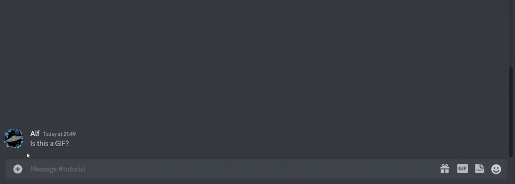

# Abstimmung starten

<figure><figcaption></figcaption></figure>


**Berechtigungen**

Eine Abstimmung kann nur gestartet werden, wenn der Bot die folgenden Berechtigungen im Kanal hat

* **Nachrichtenverlauf anzeigen**
* **Reaktionen hinzufügen**


## Befehl

Rechtsklick auf eine Nachricht. Apps > Abstimmung starten

## Aktion

Fügt eine Daumen-hoch- und Daumen-runter-Reaktion zu der ausgewählten Nachricht hinzu.
