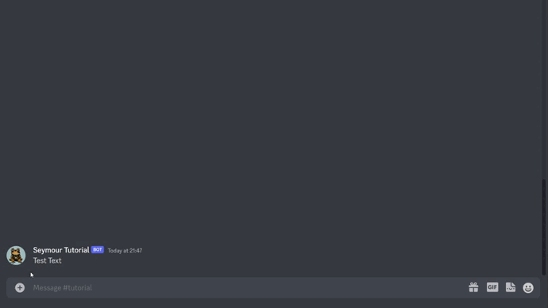

# Nachricht bearbeiten


**Berechtigungen**

Um eine Nachricht bearbeiten zu können, muss der Bot, wie beim Senden, über die Berechtigungen **Kanal anzeigen** und **Nachrichten senden** verfügen.


## Befehl

Rechtsklick auf eine Bot-Nachricht. Apps > Nachricht bearbeiten

## Aktion

Bearbeitet eine bestehende Nachricht des Bots.

## Antwort


_Nachricht bearbeitet._



* Keine Nachricht von mir.

