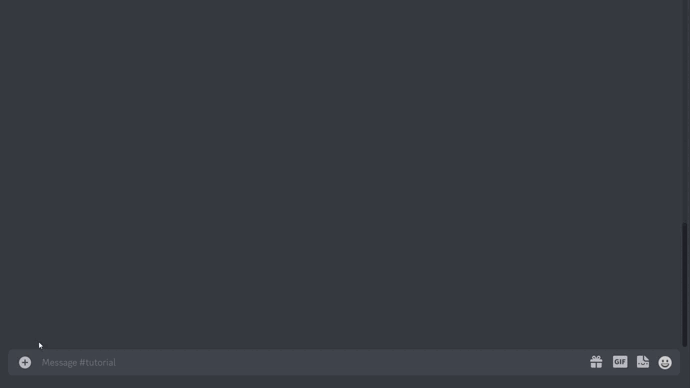

# Nachricht senden


**Berechtigungen**

Um eine Nachricht senden zu können muss der Bot über die Berechtigungen **Kanal anzeigen** und **Nachrichten senden** verfügen.


## Befehl

/nachricht\_senden

## Aktion

Lässt den Bot eine Nachricht an denselben Kanal senden. Der Autor der Nachricht ist dadurch der Bot und nicht der Benutzer selbst.


Zum Bearbeiten der Nachricht siehe [nachricht-bearbeiten.md](nachricht-bearbeiten.md "mention")

