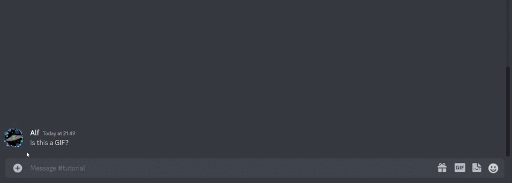

# Start Vote

<figure><figcaption></figcaption></figure>


**Permissions**

A vote can only be started if the bot has the following permissions in the channel

* **Read Message History**
* **Add Reactions**


## Command

Right click a message. Apps > Start vote

## Action

Adds a thumbs up and thumbs down reaction to the selected message.
