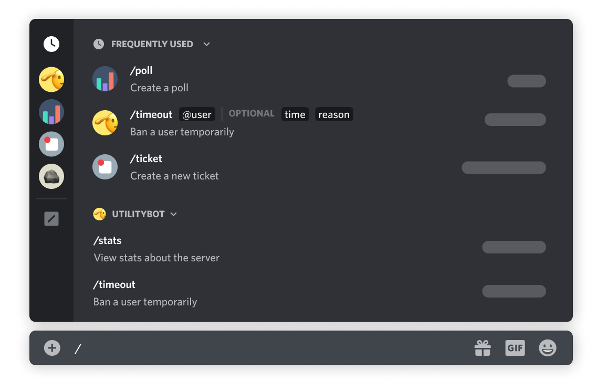
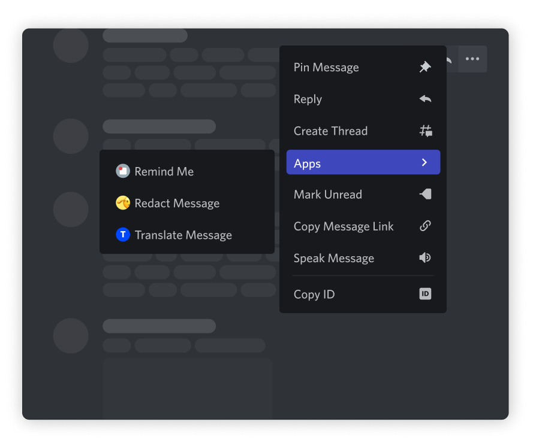

# Commands

## Slash Command

| Command      | Default Required Permission | Details                                      |
| ------------ | --------------------------- | -------------------------------------------- |
| Admin        | Administrator               | [admin.md](admin.md "mention")               |
| Copy         | Manage Messages             | [copy.md](copy.md "mention")                 |
| Post Message | Manage Messages             | [post-message.md](post-message.md "mention") |

<figure><figcaption></figcaption></figure>

## Message Context Menu

| Command      | Default Required Permission | Details                                      |
| ------------ | --------------------------- | -------------------------------------------- |
| Edit Message | Manage Messages             | [edit-message.md](edit-message.md "mention") |
| Start Vote   | Add Reactions               | [start-vote.md](start-vote.md "mention")     |

<figure><figcaption></figcaption></figure>

_Discords_ [_Slash Commands FAQ_](https://support.discord.com/hc/en-us/articles/1500000368501-Slash-Commands-FAQ) _and_ [_Application Commands_](https://discord.com/developers/docs/interactions/application-commands)
